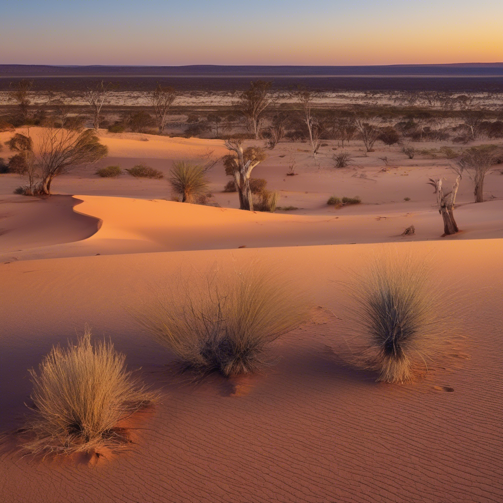
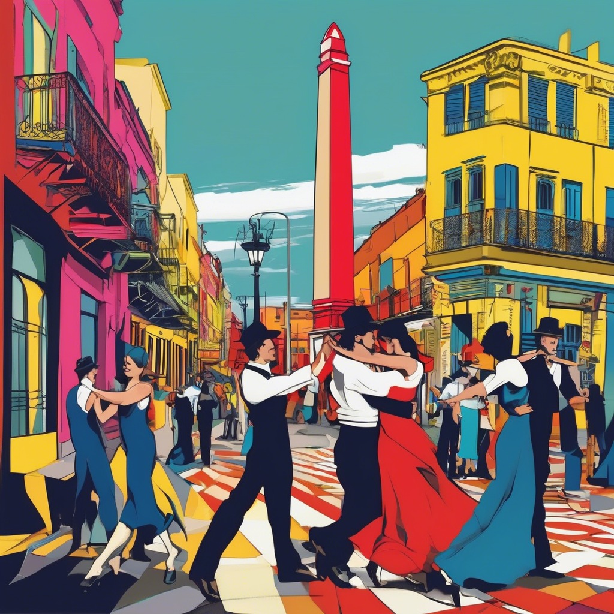

# 📚 GeoCLIP as an Evaluation Method for Real-World Image Generation

This project, uses **GeoCLIP** as a method to evaluate the real-world image generation capabilities of AI models. 
The core idea is to assess how accurately a generated image corresponds to its intended GPS location.

---

## 🌍 What is GeoCLIP?

[GeoCLIP](https://arxiv.org/abs/2309.16020) is a novel **CLIP-inspired** approach for image-to-GPS retrieval. It enforces alignment between an image and its corresponding GPS location. \
This approach improves upon traditional methods that require a large gallery of geo-tagged images, which is not scalable. It also addresses the problem with recent approaches that discretize the world into cells, which can lead to significant errors, especially in sparsely populated areas.

---

## 🔬 Working Pipeline

The project follows a specific pipeline to evaluate image generation models:

1.  **Prompts and Coordinates Generation**: The Gemini API is used to generate a Python dictionary where:
    - keys are string prompts for images 
    - values are tuples of latitude and longitude coordinates.
2.  **Image Generation**: Images are generated using a generative model (in this case [stable-diffusion-xl](https://huggingface.co/spaces/stabilityai/stable-diffusion/tree/main)) based on the prompts created in the previous step.
3.  **GPS Prediction**: The GeoCLIP model computes a GPS prediction for each generated image.
4.  **Accuracy Metrics**: The accuracy is calculated by comparing the predicted GPS coordinates from GeoCLIP with the ground truth GPS coordinates used for the prompt.

---

## 🧪 Evaluation Methods

The project uses two primary evaluation methods to determine the accuracy of the generated images:

<details>
<summary>eval_images</summary>

```python
def eval_images(image_dataloader, model, data_dir):
    model.eval()
    preds = []
    targets = []
    filenames = []

    with torch.no_grad():
        for imgs, labels in tqdm(image_dataloader, desc="Evaluating"):
            labels = labels.cpu().numpy()
            for img, label in zip(imgs, labels):
                top_pred_gps, top_pred_prob = model.predict(img, top_k=10)
                preds.append(top_pred_gps[0])
                targets.append(label)
                filenames.append(img)

    distance_thresholds = [2500, 750, 200, 25, 1]  # km

    accuracy_results = {}
    out_of_thresholds = {str(dis): [] for dis in distance_thresholds}

    for dis in distance_thresholds:
        correct = 0
        for pred, target, filename in zip(preds, targets, filenames):
            gd = GD(pred, target).km

            # Out of threshold
            if gd > dis:
                out_of_thresholds[str(dis)].append({
                    "filename": filename,
                    "pred_gps": [float(pred[0]), float(pred[1])]
                })

            # In threshold
            if gd <= dis:
                correct += 1

        acc = correct / len(targets)
        accuracy_results[f'acc_{dis}_km'] = acc
        print(f"Accuracy at {dis} km: {acc}")

    # Save out-of-threshold filenames to a log file
    log_path = os.path.join(os.getcwd(), f"{data_dir}/out_of_thresholds.json")
    with open(log_path, 'w') as f:
        json.dump(out_of_thresholds, f, indent=2)

    return accuracy_results
```

</details>

This function calculates accuracy based on a single prediction, the single most probable GPS location. 
The geodesic distance is computed between this single prediction and the ground truth location. 
The accuracy is measured as the percentage of images that fall within a certain distance threshold from the ground truth location.

<details>
<summary>eval_images_detailed</summary>

```python
def eval_images_detailed(image_dataloader, model, data_dir):
    model.eval()
    preds = {}
    targets = []

    with torch.no_grad():
        for imgs, labels in tqdm(image_dataloader, desc="Evaluating"):
            labels = labels.cpu().numpy()
            for img, label in zip(imgs, labels):
                top_pred_gps, top_pred_prob = model.predict(img, top_k=10)
                preds[img] = top_pred_gps
                targets.append(label)

    distance_thresholds = [2500, 750, 200, 25, 1]  # km

    accuracy_results = {}
    out_of_thresholds = {str(dis): [] for dis in distance_thresholds}

    for dis in distance_thresholds:
        correct = 0
        for (filename, pred_list), target in zip(preds.items(), targets):
            is_in = False
            out_pred = (0.0, 0.0)
            for pred in pred_list:
                gd = GD(pred, target).km

                # In threshold
                if gd <= dis:
                    is_in = True
                    break
                else:
                    out_pred = pred

            if is_in:
                correct += 1
            else:
                out_of_thresholds[str(dis)].append({
                    "filename": filename,
                    "pred_gps": [float(out_pred[0]), float(out_pred[1])]
                })

        acc = correct / len(targets)
        accuracy_results[f'acc_{dis}_km'] = acc
        print(f"Accuracy at {dis} km: {acc}")

    # Save out-of-threshold filenames to a log file
    log_path = os.path.join(os.getcwd(), f"{data_dir}/out_of_thresholds.json")
    with open(log_path, 'w') as f:
        json.dump(out_of_thresholds, f, indent=2)

    return accuracy_results
```

</details>

This function offers a more granular evaluation by considering multiple predictions. 
For each image, the model predict the top 10 most probable GPS locations. 
If at least one of these top 10 predictions is within the distance threshold of the ground truth, the prediction is considered correct.

---

## 📊 Datasets and Results

The evaluation was performed on four datasets, each with a size of 100 images: **City**, **Cartoon Style City**, **Natural Landscapes**, and **Fish Market**. 
Various distance thresholds are use for evaluation, ranging from 1 km to 2500 km.

The results show the accuracy percentage for each dataset at different distance thresholds:

| Dataset | 1 km | 25 km | 200 km | 750 km | 2500 km |
| :--- | :--- | :--- | :--- | :--- | :--- |
| **City** | 25.5% | 81.6% | 89.8% | 94.9% | 99.0% |
| **City Cartoon** | 18.0% | 48.0% | 51.0% | 66.0% | 78.0% |
| **Fish Markets** | 15.1% | 25.2% | 38.4% | 53.5% | 77.8% |
| **Natural Landscapes** | 27.0% | 64.0% | 77.0% | 88.0% | 91.0% |

---

## ❌ Out of Threshold Images

Images that fall outside the confidence region are most likely due to generation errors or are too difficult for a human to guess based on the visual information.

<details>
<summary>Images sample</summary>
<p align="middle">
    
        La Boqueria Market, Barcelona, Spain
    
        Great Victoria Desert, Australia
    
        La Boca, Buenos Aires, Argentina
</p>
</details>

---

## Conclusion

**GeoCLIP** can be a good method for evaluating the geolocation accuracy of generated images. \
This method takes into account both the **quality of the images** and their **consistency with the prompt generation**.